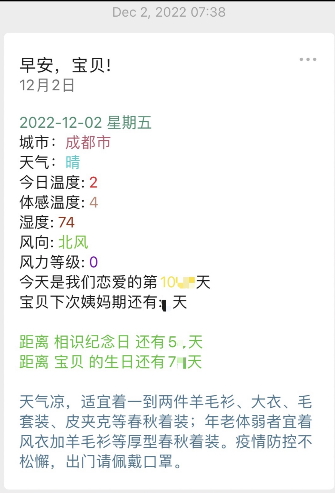
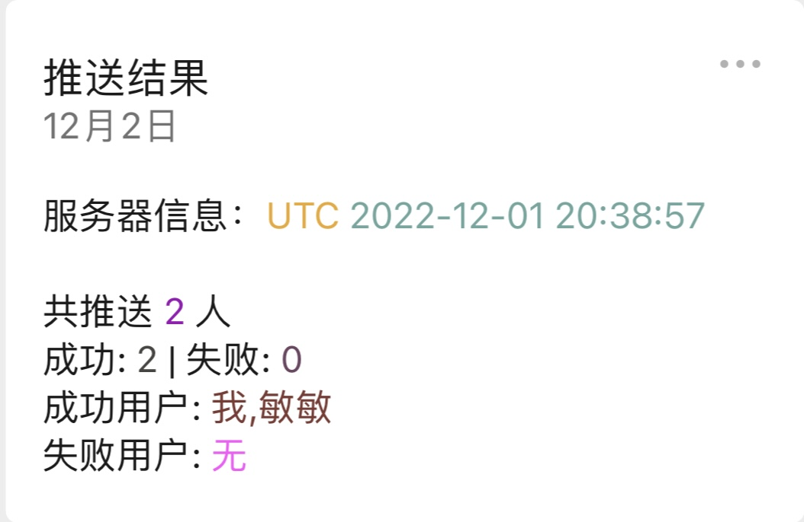

# WeChat-Auto-Messager

This small program sends daily messages to couples on a schedule. It includes reminders for important anniversary dates, birthdays, and weather updates. Additionally, it offers customizable message templates. The purpose is to reduce arguments caused by forgetting important dates and to enhance the relationship between couples.

This project involves refactoring an [old project](https://github.com/ChengGuang-Li/wechat-love-push)   that has been running steadily for 471 days, while also adding new functionalities.

The following are screenshots of the old project： 

  
  
 Message Content Example

  
  
Notification Delivery Feedback Example

